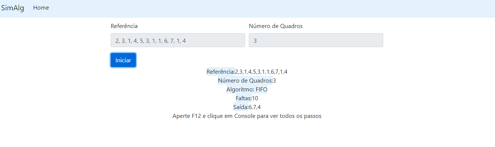

# Projeto SimAlg

Este projeto teve como objetivo criar um simulador de um algoritmo de substituição de páginas para o trabalho da disciplina de Sistemas Operacionais Abertos(SOA).

## Algoritmo escolhido:
- FIFO - First IN - First Out

Este algoritmo substitui a página lógica que está há mais tempo na memória.

## 5 passos para utilizar:
1. Baixe os arquivos do projeto (clicando em "Code"(Botão verde) e após isso em "Download ZIP") 
2. Abra o arquivo "index.html".
3. A entrada do algoritmo deverá ser uma sequência numérica, separada por vírgula (como no exemplo abaixo), que será utilizada como array de referência. 
4. Em seguida, defina a quantidade de quadros que a memória dispõe.
5. Clique em: "Iniciar" para iniciar a simulação.

## Tecnologias utilizadas:

  - [HTML](https://www.w3schools.com/html/default.asp)
  - [CSS](https://www.w3schools.com/css/)
  - [JavaScript](https://www.w3schools.com/js/)
  - [Bootstrap](https://getbootstrap.com.br/)

## Exemplo de uso:

## Licença

#### Esse projeto está sob a licença [MIT](./LICENSE). Veja o arquivo [LICENSE](./LICENSE) para mais detalhes.
